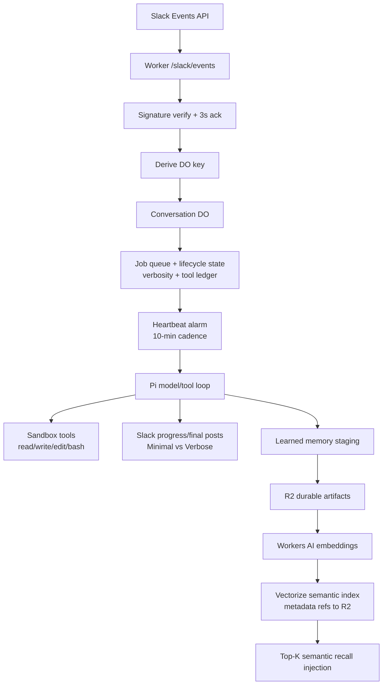

# Pi Autonomy Architecture (Phase 8)

## Canonical request flow

1. Slack sends an Events API request to Worker `/slack/events`.
2. Worker verifies signature, acknowledges quickly, and derives deterministic conversation key.
3. Worker routes message to a Durable Object instance keyed by conversation scope.
4. DO persists/updates job state and enqueues work.
5. Job execution runs in sandbox-backed Pi loop with tools: `read`, `write`, `edit`, `bash`.
6. Model loop iterates tool calls and reasoning until completion/stop conditions.
7. Worker posts progress/final summary to Slack according to conversation verbosity.
8. State + memory artifacts are persisted in R2 and semantically indexed in Vectorize.

## Slack keyword command surface

Exact, case-insensitive keyword commands are intercepted before normal chat handling:

- `settings` → returns current verbosity and how to change it.
- `set minimal` / `set verbose` → updates per-conversation verbosity in Durable Object state.
- `status` → reports sandbox/repo state, recent tool ledger, R2 memory flush info, and Vectorize health.
- `selftest` → runs an end-to-end validation flow for bootstrap, tools, R2 persistence, and Vectorize queryability.

Commands only trigger on exact text matches (trimmed), so messages like `status please` are treated as normal chat.

## Verbosity model

Durable Object state stores `verbosity` with allowed values:

- `minimal` (default): only lightweight acknowledgement (if needed) and final response.
- `verbose`: emits one-line tool ledger entries including tool name, success/failure, and duration; includes short failure excerpts.

Verbosity is conversation-scoped and survives Worker/DO restarts.

## Deterministic DO keying rules

Use exactly one key strategy per inbound message:

- Threaded message: `team_id:channel_id:thread_ts`
- Top-level channel message (no thread): `team_id:channel_id:channel`
- DM: `team_id:user_id:dm`

This ensures deterministic routing, strong conversation isolation, and resumability.

## Tool surface (strict)

Only these tools are exposed to autonomous execution:

- `read(path)`
- `write(path, content)`
- `edit(path, oldText, newText)`
- `bash(command)`

## Memory architecture (R2 + Vectorize)

Memory pipeline:

1. Workspace-local ephemeral state accumulates learned entries during execution.
2. End-of-job (or scheduled) flush writes learned artifacts to R2 as the source of truth.
3. Embeddings are generated with Workers AI for memory text.
4. Vectorize stores lightweight semantic references (ID + metadata such as R2 key, timestamp, conversation key, tags).
5. Query-time recall fetches top-K Vectorize hits and injects bounded semantic context into prompts.

Constraints:

- Full memory content remains in R2 artifacts.
- Vectorize stores references/metadata only.
- Semantic injection is capped (for example top K and max characters) to avoid context bloat.

## Self-test architecture path

`selftest` validates the full path with safe operations:

1. Repo bootstrap (`/workspace/<repoDir>` exists; clone/update as needed).
2. Tool checks (`read`, `write`, `edit`, `bash`) using `.blob/selftest.txt` only.
3. Learned record creation and R2 persistence verification.
4. Embedding generation and Vectorize upsert.
5. Vectorize query for inserted semantic term and hit verification.
6. Concise pass/fail response (plus step-by-step details in verbose mode).

## Scheduling model

Two-tier scheduling:

1. **DO alarm heartbeat** every 10 minutes for interactive/autonomous job lifecycle work.
2. **Wrangler cron triggers** for heavy periodic maintenance tasks.

## Architecture diagram

