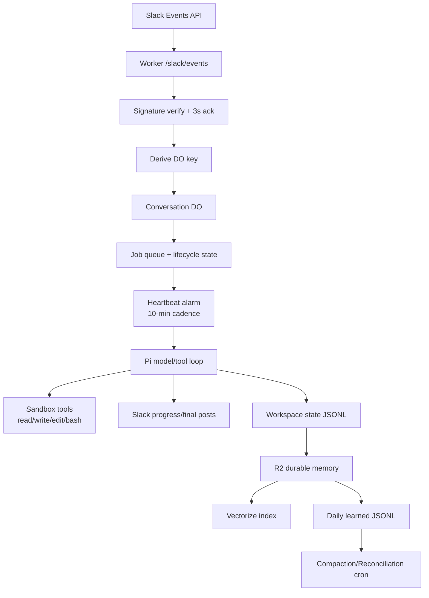

# Pi Autonomy Architecture (Phase 1)

## Canonical request flow

1. Slack sends an Events API request to Worker `/slack/events`.
2. Worker verifies signature, acknowledges quickly, and derives deterministic conversation key.
3. Worker routes message to a Durable Object instance keyed by conversation scope.
4. DO persists/updates job state and enqueues work.
5. Job execution runs in sandbox-backed Pi loop with tools: `read`, `write`, `edit`, `bash`.
6. Model loop iterates tool calls and reasoning until completion/stop conditions.
7. Worker posts progress and final summary back to Slack.
8. State + memory are persisted and indexed for future recall.

## Deterministic DO keying rules

Use exactly one key strategy per inbound message:

- Threaded message: `team_id:channel_id:thread_ts`
- Top-level channel message (no thread): `team_id:channel_id:channel`
- DM: `team_id:user_id:dm`

This ensures deterministic routing, strong conversation isolation, and resumability.

## Thread-to-channel migration behavior

**Chosen approach: copy-on-first-thread-message.**

When a thread starts from a top-level message, initialize thread state by copying relevant channel-level context once, then treat the thread as isolated state.

Rationale:
- Predictable context snapshot at thread creation.
- Avoid repeated lazy reads from channel state.
- Better auditability for thread-specific execution and memory.

## Tool surface (strict)

Only these tools are exposed to autonomous execution:

- `read(path)`
- `write(path, content)`
- `edit(path, oldText, newText)`
- `bash(command)`

No additional pseudo-tools or HTTP-template tools are part of the canonical surface.

## Scheduling model

Two-tier scheduling:

1. **DO alarm heartbeat** every 10 minutes for interactive/autonomous job lifecycle work.
2. **Wrangler cron triggers** for heavy periodic maintenance tasks.

Heartbeat responsibilities:
- Resume paused jobs with remaining budget.
- Start queued jobs oldest-first.
- Respect per-heartbeat model call limits.
- Defer heavy jobs exceeding cycle budget.
- Emit daily summary once after UTC midnight (if enabled).

## Memory architecture

Memory pipeline:

1. Workspace-local ephemeral state (`/workspace/blob_state/log.jsonl`, `context.jsonl`).
2. R2 as source of truth for durable memory artifacts.
3. Vectorize as semantic index referencing R2 items.
4. Daily learned flush to JSONL + upload to R2.
5. Compaction/reconciliation jobs to control growth and quality.

Constraint: full content remains in R2; Vectorize metadata stores lightweight references only.

## Cost control model

Apply layered safeguards (env-configurable):

- Per-job token budget.
- Per-heartbeat model call limit.
- Daily aggregate token ceiling.

Enforcement outcomes:
- Exhausted budget → pause/defer job.
- Daily ceiling breach → skip non-critical work and notify.
- Logs emit usage for audit and tuning.

## Architecture diagram

## Happy-path walkthrough

1. User posts a threaded Slack request to modify a repo file.
2. Worker validates signature and immediately ACKs.
3. Worker computes key `team:channel:thread_ts` and routes to DO.
4. DO creates/updates a queued job with resume state.
5. Heartbeat picks the job, provisions/reuses sandbox.
6. Pi loop reads target file, edits code, validates with `bash` command.
7. Job reaches completion condition and persists final outputs.
8. Worker posts completion summary (and PR/deploy status when enabled).
9. Memory artifacts are appended to workspace logs, flushed to R2, and indexed.

## Runtime boundaries

- Worker handles ingress/egress, routing, and lightweight orchestration.
- DO is authoritative for job state transitions and heartbeat ownership.
- Sandbox executes filesystem/shell operations only via four tools.
- Cron handles heavy maintenance outside interactive loops.
